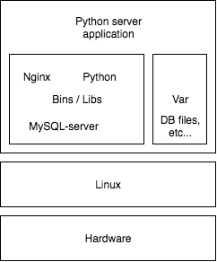
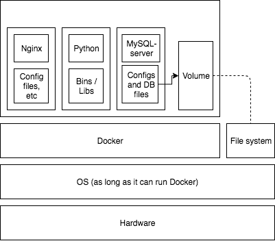

# Exercise 3.7 b)

## Should I use Docker?

Docker can be described as a tool for delivering software in bundles called containers, which are run in their own user space on top of the operating system. That is very cool, but when would this be useful?

When working in a team of developers there may be a great number of different computer setups in use. Docker can solve this problem due to the images being portable and working identically on any system that can run Docker. The local development can also be made to closely match the production environment, reducing the need to access remote servers.

Another great use for Docker is quickly setting up a basic application. For standard use cases like a MERN or LAMP stack using a reverse proxy for hosting a website the default images can be sufficient for the situation. Using a well-supported and preconfigured image saves time spent installing tooling and the environment.

Having the exact specifications of the environment for an application stored in a Dockerfile and an image on Docker Hub also means that the application environment is well documented and can be easily transferred from one system to another. Dependencies are contained and do not affect the environment of the computer or other containers. Therefore, when, for example, running a website each component can be separated into a container without needing to worry about conflicting dependencies between components.

Continuous integration pipelines, such as Travis, Circle CI, and Jenkins, can make great use Docker. When a new version needs to be deployed it can be saved as a Docker image, tagged with the version number and pushed to Docker Hub, from where it can be pulled by integration tools for building a, for example, a staging or production deployment.

## Example

Here is a website example using a LAMP (Linux, Apache/Nginx, MySQL, PHP/Perl/Python) stack with and without Docker.

Without Docker the host needs to be running Linux and have the correct version of Python  installed. Then it needs to have MySQL-server installed, as well as a version of Nginx. Nginx need a configuration for how it routes traffic to the Python server. Environment visual:

With Docker the Dockerfiles would define the environments for each part of the website. The Python server would be in its own container with the correct version of python and its dependencies. The MySQL-server would also be in its own container with a mounted volume. Lastly the Nginx reverse proxy would be setup in its own container. Environment visual:

